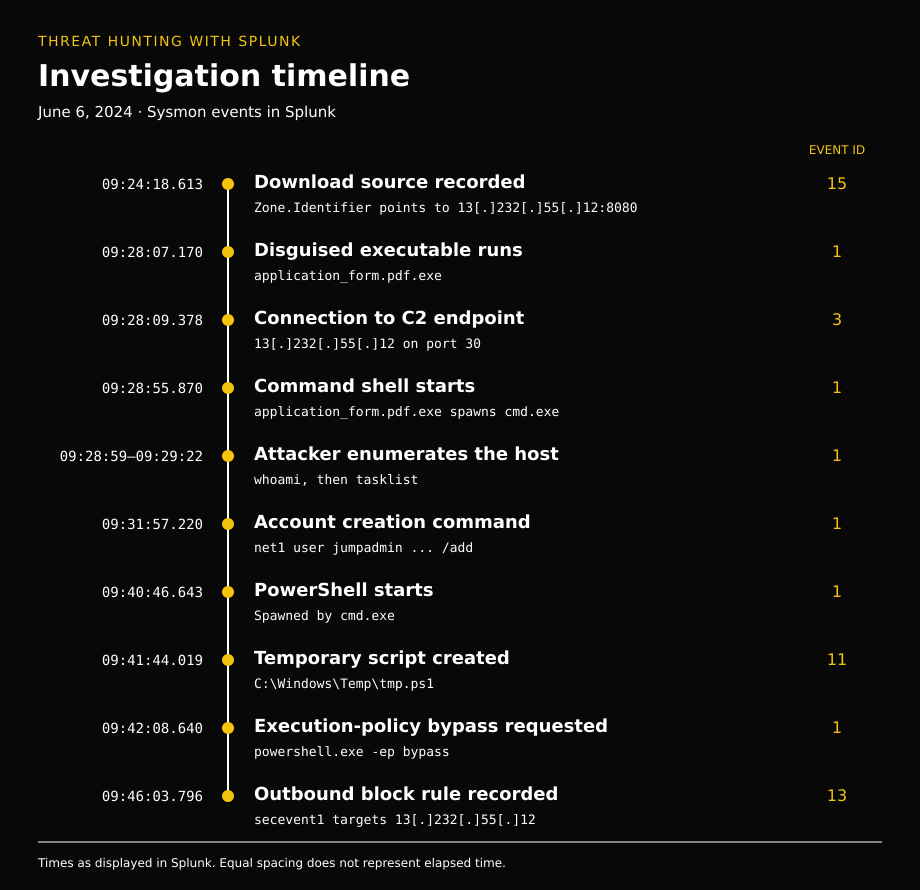

# Threat Hunting with Splunk - Sherlock Writeup


*A threat hunting walkthrough tracing a disguised executable, C2 activity, and attacker commands through Sysmon logs in Splunk.*

by: Brandon Chaney

## Overview

To start this Sherlock, all I’m told is to hunt for C2 activity in Splunk.

> Using Sysmon events and SPL queries, this investigation demonstrates how process relationships, download metadata, and network activity can be correlated to reconstruct an attack.

## Suspicious Process Creation

I started by looking into Sysmon Event ID 1, process creation, to see if I could get a feel for which process may be behind the C2 activity, and found something quite out of the ordinary: an application masquerading as a PDF…

```spl
sourcetype="XmlWinEventLog:Microsoft-Windows-Sysmon/Operational"
EventCode=1
| table _time Image CommandLine ParentImage User
| sort _time
```

| _time | Image | CommandLine |
| --- | --- | --- |
| 2024-06-06 09:28:07.170 | `C:\Users\LetsDefend\Downloads\application_form.pdf.exe` | `"C:\Users\LetsDefend\Downloads\application_form.pdf.exe"` |

## File Creation and Download Source

And we can see when this file was created using Event ID 11, `FileCreate`.

```spl
sourcetype="XmlWinEventLog:Microsoft-Windows-Sysmon/Operational"
EventCode=11
"application_form.pdf.exe"
| table _time TargetFilename CreationUtcTime
```

| _time | TargetFilename | CreationUtcTime |
| --- | --- | --- |
| 2024-06-06 09:24:18.611 | `C:\Users\LetsDefend\Downloads\application_form.pdf.exe:Zone.Identifier` | 2024-06-06 09:24:11.763 |

> This row targets the file’s `Zone.Identifier` stream. `_time` is the event time shown by Splunk; `CreationUtcTime` is a separate UTC creation timestamp recorded in the event. I kept those distinct when building the timeline.

Pivoting to Event ID 15 to see NTFS ADS creations shows the `HostUrl` with a `ZoneId` of 3, indicating the file was downloaded from the Internet.

```spl
sourcetype="XmlWinEventLog:Microsoft-Windows-Sysmon/Operational"
EventCode=15
"application_form.pdf.exe"
| table _time TargetFilename Contents
```

| _time | TargetFilename | Contents |
| --- | --- | --- |
| 2024-06-06 09:24:18.613 | `C:\Users\LetsDefend\Downloads\application_form.pdf.exe:Zone.Identifier` | `[ZoneTransfer] ZoneId=3 ReferrerUrl=http://13(.)232(.)55(.)12:8080/ HostUrl=http://13(.)232(.)55(.)12:8080/application_form.pdf.exe` |
| 2024-06-06 09:24:18.613 | `C:\Users\LetsDefend\Downloads\application_form.pdf.exe` | - |
| 2024-06-06 09:24:18.612 | `C:\Users\LetsDefend\Downloads\application_form.pdf.exe:Zone.Identifier` | `[ZoneTransfer] ZoneId=3 ReferrerUrl=http://13(.)232(.)55(.)12:8080/` |
| 2024-06-06 09:24:18.612 | `C:\Users\LetsDefend\Downloads\application_form.pdf.exe` | - |
| 2024-06-06 09:24:18.612 | `C:\Users\LetsDefend\Downloads\application_form.pdf.exe:Zone.Identifier` | `[ZoneTransfer] ZoneId=3` |
| 2024-06-06 09:24:18.611 | `C:\Users\LetsDefend\Downloads\application_form.pdf.exe` | - |

The artifact `13(.)232(.)55(.)12` can be marked down as the malicious host server. This does not give proof of C2 yet, so I’ll keep investigating.

## Finding the C2 Connection

Seeing what network connections the malicious file made points to one source: `13(.)232(.)55(.)12` over port **30**. This is the C2!

```spl
sourcetype="XmlWinEventLog:Microsoft-Windows-Sysmon/Operational"
EventCode=3
Image="*application_form.pdf.exe"
| table _time Image DestinationIp DestinationPort DestinationHostname
```

| _time | Image | DestinationIp | DestinationPort | DestinationHostname |
| --- | --- | --- | --- | --- |
| 2024-06-06 09:28:09.378 | `C:\Users\LetsDefend\Downloads\application_form.pdf.exe` | 13(.)232(.)55(.)12 | 30 | - |

> Event ID 3 links the connection to the process, but it does not show the traffic contents. The C2 conclusion comes from the surrounding attack activity; the port number alone would not establish it.

## Command Shell and Enumeration

Next, we can see that the trojan `application_form.pdf.exe` spawned an instance of `cmd.exe` (bad!) at **2024-06-06 09:28:55.870**.

```spl
sourcetype="XmlWinEventLog:Microsoft-Windows-Sysmon/Operational"
EventCode=1
Image="*cmd.exe"
| table _time Image CommandLine ParentImage User
| sort _time
```

| _time | Image | CommandLine | ParentImage | User |
| --- | --- | --- | --- | --- |
| 2024-06-06 09:28:55.870 | `C:\Windows\System32\cmd.exe` | `C:\Windows\system32\cmd.exe` | `C:\Users\LetsDefend\Downloads\application_form.pdf.exe` | `DESKTOP-ND6FH5D\LetsDefend` |

Pivoting to see processes spawned by `cmd.exe` yields three results: the attacker performs some enumeration and moves to PowerShell.

| _time | Image | CommandLine | ParentImage |
| --- | --- | --- | --- |
| 2024-06-06 09:28:59.038 | `C:\Windows\System32\whoami.exe` | `whoami` | `C:\Windows\System32\cmd.exe` |
| 2024-06-06 09:29:22.085 | `C:\Windows\System32\tasklist.exe` | `tasklist` | `C:\Windows\System32\cmd.exe` |
| 2024-06-06 09:40:46.643 | `C:\Windows\System32\WindowsPowerShell\v1.0\powershell.exe` | `powershell.exe` | `C:\Windows\System32\cmd.exe` |

## Creating a Local Account

Checking further for process creation, but in the hopes of finding something like `net user supercoolguy123 /add`, we can see the command to create a user named **jumpadmin** with the password `U7gk54skuvhs@1`.

| _time | Image | CommandLine |
| --- | --- | --- |
| 2024-06-06 09:31:57.220 | `C:\Windows\System32\net1.exe` | `C:\Windows\system32\net1 user jumpadmin U7gk54skuvhs@1 /add` |

The command showed the intended account creation. It did not show the command’s success status or prove that `jumpadmin` was added to the Administrators group.

## Finding the PowerShell Script

Next, we need to find their post-enumeration script. I use Event ID 11 to look for suspicious files created on disk, to no avail. Next, I consider files made specifically by PowerShell after **09:40:46**, when PowerShell first becomes active in the attack. And to my surprise, there is a temporary PowerShell script!

```spl
sourcetype="XmlWinEventLog:Microsoft-Windows-Sysmon/Operational"
EventCode=11
Image="*powershell.exe"
| table _time TargetFilename Image
| sort _time
```

| _time | TargetFilename | Image |
| --- | --- | --- |
| 2024-06-06 09:19:22.632 | `C:\Users\LetsDefend\AppData\Local\Microsoft\Windows\PowerShell\StartupProfileData-Interactive` | `C:\Windows\System32\WindowsPowerShell\v1.0\powershell.exe` |
| 2024-06-06 09:40:47.089 | `C:\Users\LetsDefend\AppData\Local\Temp\__PSScriptPolicyTest_i4gtmd03.cxz.ps1` | `C:\Windows\System32\WindowsPowerShell\v1.0\powershell.exe` |
| 2024-06-06 09:41:44.019 | `C:\Windows\Temp\tmp.ps1` | `C:\Windows\System32\WindowsPowerShell\v1.0\powershell.exe` |
| 2024-06-06 09:42:08.698 | `C:\Users\LetsDefend\AppData\Local\Temp\__PSScriptPolicyTest_kzd5gc12.vcd.ps1` | `C:\Windows\System32\WindowsPowerShell\v1.0\powershell.exe` |

The file that stood out was **`C:\Windows\Temp\tmp.ps1`**, created at **09:41:44.019**.

> PowerShell normally creates `__PSScriptPolicyTest_*` files to check application-control policy. Their presence alone is not malicious. `tmp.ps1` was the file worth following here, although this event only shows its creation—not its contents or execution.

## Execution Policy Bypass

The next direction is to find PowerShell execution-policy bypass activity. For this, I look to PowerShell process-creation events where the command line has some sort of exec bypass, which there was!

```spl
sourcetype="XmlWinEventLog:Microsoft-Windows-Sysmon/Operational"
EventCode=1
Image="*powershell.exe"
(CommandLine="*-ExecutionPolicy Bypass*" OR CommandLine="*-Exec Bypass*" OR CommandLine="*-ep bypass*")
| table _time Image CommandLine ParentImage User
| sort _time
```

| _time | Image | CommandLine | ParentImage | User |
| --- | --- | --- | --- | --- |
| 2024-06-06 09:42:08.640 | `C:\Windows\System32\WindowsPowerShell\v1.0\powershell.exe` | `"C:\Windows\System32\WindowsPowerShell\v1.0\powershell.exe" -ep bypass` | `C:\Windows\System32\WindowsPowerShell\v1.0\powershell.exe` | `DESKTOP-ND6FH5D\LetsDefend` |

> `-ep bypass` requests the Bypass execution policy for that PowerShell session. It does not permanently change the machine-wide policy or bypass higher-priority Group Policy settings. Execution policy also is not a security boundary.

## Firewall Rule and Response

And the admin apparently added a firewall rule amidst the alert triggering. I used timing context and looked for registry changes (Sysmon 12/13) where the target object was firewall rules. Only one stood out—it contained the C2 IP and a block rule, so this had to be the one.

```spl
sourcetype="XmlWinEventLog:Microsoft-Windows-Sysmon/Operational"
(EventCode=12 OR EventCode=13)
TargetObject="*FirewallRules*"
| table _time EventCode Image TargetObject Details
| sort _time
```

| _time | EventCode | Image | TargetObject | Details |
| --- | --- | --- | --- | --- |
| 2024-06-06 09:46:03.796 | 13 | `C:\Windows\system32\svchost.exe` | `HKLM\System\CurrentControlSet\Services\SharedAccess\Parameters\FirewallPolicy\FirewallRules\{06FFAC87-16FB-4F65-8BCB-FE8C075F0ABA}` | `v2.30\|Action=Block\|Active=TRUE\|Dir=Out\|RA4=13(.)232(.)55(.)12\|Name=secevent1\|` |

The rule was named **`secevent1`**. Its contents showed an active outbound block targeting the remote IPv4 address `13(.)232(.)55(.)12`.

Lastly, we just have to find the user recorded for this rule change. I just added the `User` field onto the firewall events and found the row with the `secevent1` rule to find user `NT AUTHORITY\LOCAL SERVICE`.

| _time | Image | User | Rule |
| --- | --- | --- | --- |
| 2024-06-06 09:46:03.796 | `C:\Windows\system32\svchost.exe` | `NT AUTHORITY\LOCAL SERVICE` | `secevent1` |

> `NT AUTHORITY\LOCAL SERVICE` is the service account recorded for the registry write. This identifies the process’s security context, not the human administrator who requested the rule. The registry event also does not prove that subsequent C2 connections were blocked successfully.

## Timeline



## Key Findings

- A double extension, `application_form.pdf.exe`, disguised an executable as a PDF.
- `Zone.Identifier` metadata tied the download to `13(.)232(.)55(.)12:8080`.
- The executable connected to the same IP on port **30**, supporting the C2 finding in this attack sequence.
- The malicious process spawned `cmd.exe`, followed by enumeration and PowerShell activity. A separate process event showed the command to create `jumpadmin`.
- PowerShell created `C:\Windows\Temp\tmp.ps1` and later launched another PowerShell process with `-ep bypass`.
- The `secevent1` firewall rule configured an outbound block for the C2 IP; the registry write ran under `NT AUTHORITY\LOCAL SERVICE`.

## Resources

- [Microsoft Sysinternals — Sysmon event reference](https://learn.microsoft.com/en-us/sysinternals/downloads/sysmon)
- [Microsoft — Zone.Identifier stream](https://learn.microsoft.com/en-us/openspecs/windows_protocols/ms-fscc/6e3f7352-d11c-4d76-8c39-2516a9df36e8)
- [Microsoft — URL security zones](https://learn.microsoft.com/en-us/previous-versions/windows/internet-explorer/ie-developer/platform-apis/ms537175(v=vs.85))
- [Microsoft — PowerShell execution policies](https://learn.microsoft.com/en-us/powershell/module/microsoft.powershell.core/about/about_execution_policies?view=powershell-5.1)
- [PowerShell project — Discussion of PSScriptPolicyTest files](https://github.com/PowerShell/PowerShell/issues/24217)
- [Splunk — Threat hunting tutorials](https://www.splunk.com/en_us/blog/security/hunting-with-splunk-the-basics.html)
